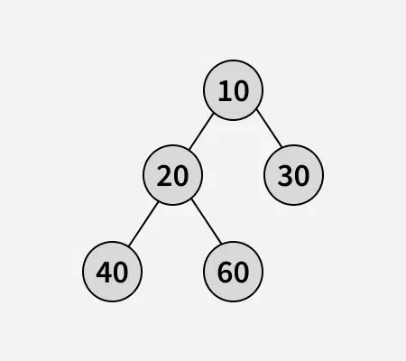

# Root to leaf paths sum
---
> Video description: https://youtu.be/t-ht9HWD-DY

[Problem](https://www.geeksforgeeks.org/problems/root-to-leaf-paths-sum/1) | [Java Solution](./Solution.java)

[](https://youtu.be/t-ht9HWD-DY)
---

Given a binary tree, where every node value is a number. Find the sum of all the numbers that are formed from root to leaf paths. The formation of the numbers would be like 10*parent + current (see the examples for more clarification).

Examples:

Input:      

Output: 13997
Explanation : There are 4 leaves, resulting in leaf path of 632, 6357, 6354, 654 sums to 13997.


Input:    

Output: 2630
Explanation: There are 3 leaves, resulting in leaf path of 1240, 1260, 130 sums to 2630.

```
Input:    
           1
          /
         2                    
Output: 12
Explanation: There is 1 leaf, resulting in leaf path of 12.
```

>Constraints:
>1 ≤ number of nodes ≤ 31
>1 ≤ node->data ≤ 100

